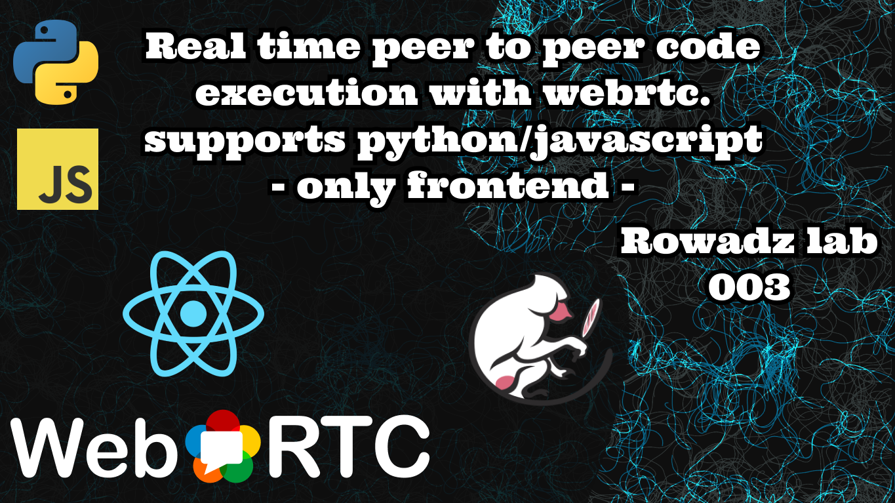

# Sabriz




Real time peer to peer code execution with [webrtc](https://webrtc.org/) and [react](https://reactjs.org/)

The code exeuction supports JavaScript and Python

# See this demo video

https://youtu.be/w3soVwq2SAw

# Notes

> This is just a frontend app, there are no backend code.
> This is served using github pages

To run it locally

```bash
$ git clone https://github.com/MohammedAl-Rowad/sabriz.git
$ cd sabriz
$ npm start
```

